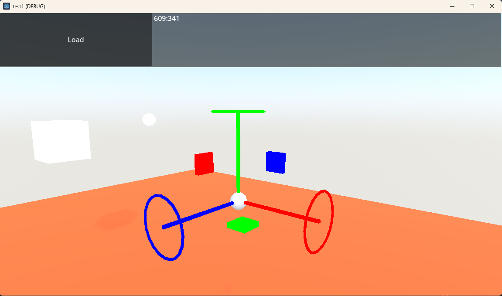

# transform_ctrl_gizmo

これはGodot Engineのランタイム実行時に 使える移動・回転コントロール（Gizmo）です。

動画：

[YouTube](https://youtu.be/58NAPNE-Y24)

## インストール

1. このリポジトリを `git clone` します。

※このリポジトリはアドオン自体のフォルダにしました。

2. このフォルダをGodotのゲームプロジェクトフォルダにコピーします。
    
    コピー元: `git clone後の親フォルダ/transform_ctrl_gizmo/`

    貼り付け先: `ゲームフォルダ/addons/transform_ctrl_gizmo`

3. Project メニュー -> Project 設定 -> プラグイン
4. `transform_ctrl_gizmo` のステータスをONにします。

## 使用方法

**Camera3D ノード**

1. 子ノードとして `TransformCtrlGizmoServer` を追加します。
2. `Main Camera` プロパティに 親のCamera3Dノードを設定します。
3. `Enable Detect` プロパティを有効にします。

**対象のノード（複数）**

1. `TransformCtrlGizmoReceiver` を子ノードとして追加します。

    **通常の3Dノード**

    2. `StaticBody3D`を子ノードとして追加します。
    3. `CollisionShape3D` を `StaticBody3D` の子ノードとして追加します。

    **`Use Collision` プロパティを持つ3Dノード**

    2. `Use collision` にチェックを入れます。

※Godotでの衝突の処理方法に準じます。

**実行時**

TransformCtrlGizmoRceiver を持つ3Dノードをクリックすると、Gizmoが表示されます。クリックを検出するため、対象のノードには衝突の機能を付ける必要があります。

GodotEngineではFBXなどの外部の3Dオブジェクトとの表示の順序がうまく動かないように思えます。

その代わりとしてTransformCtrlGizmoRceiver のプロパティに Show Offset があります。そのプロパティでgizmoの表示位置を3Dノード別にずらすことができます。

## カスタマイズ

### TransformCtrlGizmoReceiver

**Receive Layer** 

将来使う予定です。

**Show Offset**

gizmoの表示位置をずらすことができます。

### TransformCtrlGizmoServer

**Controller**

内部シーン `TCGizmoTop` です。自動的に生成されます。

**Target**

クリックして検知されたノードです。

**Main Camera**

参照するカメラノードです。未指定の場合、初期化時に自動的に親ノードをカメラノードとしてセットします。

**Enable Detect**

検出を開始します。

## 後記

Godot Engine でランタイム実行時にオブジェクトを移動・回転できるGizmoが欲しくてこのアドオンを作成しました。

しかしまだ機能的には足りていません。

改造できる方はぜひこのアドオンを改良してみてください。

# 開発者

NISHIWAKI(lumis)

[X(Twitter) ](https://twitter.com/lumidina)

[Mastodon](https://mstdn.jp/@lumidina)

