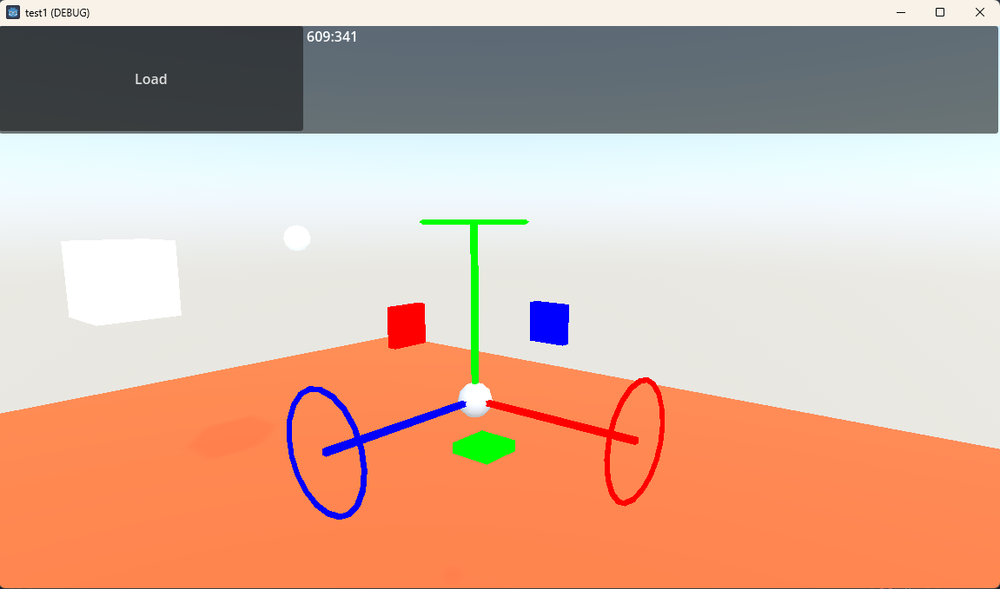

# transform_ctrl_gizmo
Transform Control (Gizmo) on runtime loading for Godot Engine

Video：

[YouTube](https://youtu.be/58NAPNE-Y24)

## To install

1. run `git clone` this repository.

*This repository is a folder for the add-on itself.

2. Copy `addons/transform_ctrl_gizmo` directory to a game project of Godot.

    src: `[parent dir after git clone]/transform_ctrl_gizmo`

    destination: `game project dir/addons/transform_ctrl_gizmo`

3. Project menu -> Project settings -> Plugin
4. Enable status of `transform_ctrl_gizmo`

## To use

**Camera3D node**

1. Add `TransformCtrlGizmoServer` as child node
2. Attach parent Camera3D to `Main Camera` property.
3. Enable `Enable Detect` property.

**Target Nodes**

1. Add `TransformCtrlGizmoReceiver` as child node.

    **Normal 3D node** 

    2. Add `StaticBody3D` as child node.
    3. Add `CollisionShape3D` as child node of `StaticBody3D`.

    **3D node has `Use collision` property**

    2. Enable `Use collision`

* Please follow how Godot handles collisions.

**On execute**

 Click on the 3D node with `TransformCtrlGizmoRceiver` and the Gizmo will appear. In order to detect clicks, the target node must be equipped with a collision function.

 In GodotEngine, it seems that the display order with external 3D objects such as FBX does not work properly. 

 Instead, there is a property of TransformCtrlGizmoRceiver called Show Offset. You can use that property to shift the display position of the gizmo for each 3D node.

## Customize

### TransformCtrlGizmoReceiver

**Receive Layer** 

Use futurely.

**Show Offset**

You can shift the display position of gizmo.

### TransformCtrlGizmoServer

**Controller**

Internal scene `TCGizmoTop`. Create automatically.

**Target**

The node detected by clicking.

**Main Camera**

Camera node to reference. If not specified, the parent node will be automatically set as the camera node during initialization.

**Enable Detect**

Start detection.

**is_global**

Switches the operating space between global and local.

## Postscript

I created this add-on because I wanted a Gizmo that could move and rotate objects during runtime execution in Godot Engine.

However, it is still not functional enough.

If you can modify it, please try improving this add-on.

# Developer

NISHIWAKI(lumis)

[X(Twitter) ](https://twitter.com/lumidina)

[Mastodon](https://mstdn.jp/@lumidina)

